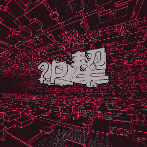

# Everyday One Motion - 20160324  

"Morphing Wordart"  

  

JavaScript, WebGL, Raymarching  

[Everyday One Motion](http://motions.work/motion/162)  
[Demo Page](http://fms-cat-eom.github.io/20160324)  

## はじめに  

Q: 時間がありませんでしたか？  
A: hai  

## WordArt

レイマーチング法では、距離関数を用いて3Dシーンを表現しますが、そういえばDistance Fieldで検索してみると、2Dのラスタ画像をくっきりと表示させる手段が多く紹介されています。  
これをレイマーチングに応用すれば、文字が描画のではないか？と考えたのも昨年の6月のこと、ずっと研究し続けていますが、なかなか綺麗に文字を描画することができませんね…  

2Dの文字画像から生成した距離テクスチャをRaymarcherのシェーダに送ってやって、いい感じにがっちゃんこするとワードアートごっこができます！ヤバイ！！！
もちろん、文字だけではなく、シルエットやロゴマークなど、二値化画像ならなんでもレイマーチングで3D描画することができます。

## Morph

ここで、距離テクスチャをクロスフェードしてやると、奇妙な文字形状の変化が現れ、スムーズに2つの文字間をモーフィングします。  
今回はこれを利用し、 [20160303](https://github.com/fms-cat-eom/20160303) で紹介したランダム文字をモーフィングさせながら描画しました。  

## Background

さすがに文字だけでは味気ないので、なにか背景を追加しようと思い、お馴染み [IFS](https://github.com/fms-cat-eom/20160317) を描画しました。  
当初は奥方向に動かしてやろうと考えていたのですが、間違えて横に動かしてしまったところ、いい感じに横スクロールSTGみたいになってかっこよかったです（小学生並みの感想）。  
そういえば、シューティングってゲーム黎明期から横にスクロールしたり縦にスクロールしたり奥にスクロールしたりしててすごいですね。  
